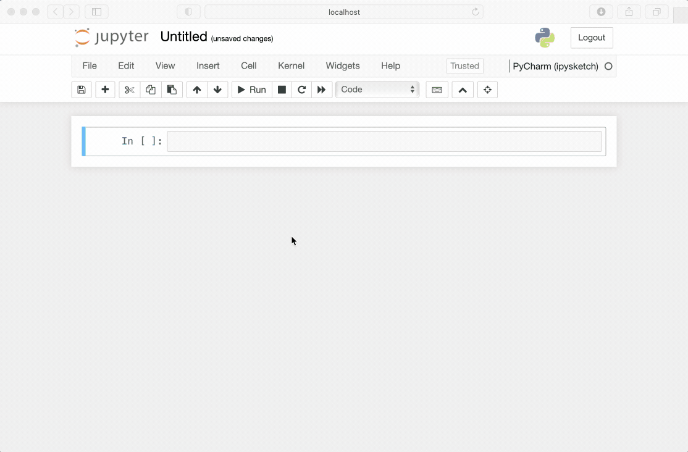
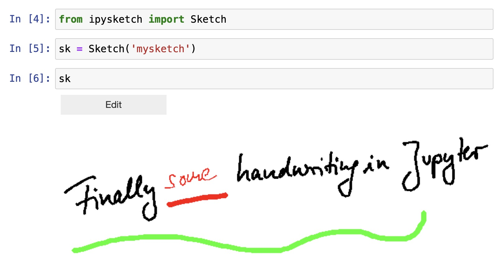

# ipysketch

[](https://badge.fury.io/py/ipysketch)

A Python package for handwriting and sketching in Jupyter notebooks.

## Usage

#### A movie is worth a thousand pictures is worth a million words...



#### But sometimes it's too fast, so...

- import ipysketch
- create a `Sketch` instance and give the sketch a name
- display the instance
- edit the sketch



#### Where are my sketches saved?

When creating a `Sketch` instance, you give it a name, say *mysketch*. The sketch is then saved
in the same folder as the Jupyter notebook in two files with ending `.isk` and `.png`. The first file 
is the *ipysketch*-internal file format, the second is a PNG-representation of it, which is also 
displayed in the notebook. 

#### Using ipysketch without Jupyter

The *ipysketch* GUI can also be used outside of Jupyter notebooks. To create a sketch named
*mysketch* enter:

```
python -m ipysketch mysketch
```

## Installation

First, install the *ipysketch* package using *pip*:

```
pip install --upgrade ipysketch
```

Then install and enable the widgets extension in Jupyter:

```
jupyter nbextension install --user --py widgetsnbextension
jupyter nbextension enable --py widgetsnbextension
```


## Compatibility

*ipysketch* require Python 3.

